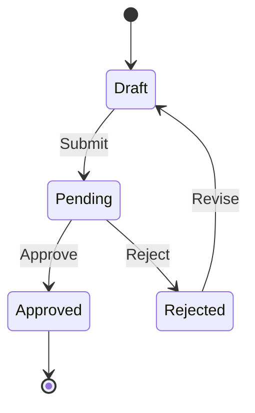

# 📋 Business Rules: [Feature Name]

> **Feature:** [F-XXX: Feature Name](./FEATURE_SPEC_TEMPLATE.md)  
> **Last Updated:** [Date]

---

## 1. Rule Execution Order

> Thứ tự áp dụng các rules (quan trọng khi có conflicts)

| Order | Category           | Description                 |
| :---: | ------------------ | --------------------------- |
|   1   | **Authentication** | Kiểm tra user đã login chưa |
|   2   | **Authorization**  | Kiểm tra quyền truy cập     |
|   3   | **Validation**     | Kiểm tra dữ liệu đầu vào    |
|   4   | **Business Logic** | Áp dụng logic nghiệp vụ     |

---

## 2. Validation Rules

| Field    | Type   | Rules                          | Error Message                     |
| -------- | ------ | ------------------------------ | --------------------------------- |
| `field1` | string | Required, min 3 chars, max 100 | "Field1 must be 3-100 characters" |
| `email`  | string | Required, valid email format   | "Please enter a valid email"      |
| `amount` | number | Required, min 0, max 999999    | "Amount must be between 0-999999" |

### Validation Logic (nếu phức tạp)

```javascript
// Ví dụ: Conditional validation
if (type === "premium") {
  require("license_key");
}
```

---

## 3. Business Logic Rules

### BR-01: [Rule Name]

| Attribute     | Value                      |
| ------------- | -------------------------- |
| **Condition** | When [condition occurs]... |
| **Action**    | Then [system does]...      |
| **Exception** | Unless [exception case]... |

**Example:**

```
Input:  { type: 'refund', amount: 100 }
Output: { status: 'pending_approval' } // Because amount > 50 requires approval
```

---

### BR-02: [Rule Name]

| Attribute     | Value               |
| ------------- | ------------------- |
| **Condition** | When [condition]... |
| **Action**    | Then [action]...    |
| **Exception** | N/A                 |

---

## 4. Permissions (RBAC Matrix)

| Action         | Admin | Manager | Staff | Partner | Guest |
| -------------- | :---: | :-----: | :---: | :-----: | :---: |
| **Create**     |  ✅   |   ✅    |  ✅   |   ❌    |  ❌   |
| **Read (Own)** |  ✅   |   ✅    |  ✅   |   ✅    |  ❌   |
| **Read (All)** |  ✅   |   ✅    |  ❌   |   ❌    |  ❌   |
| **Update**     |  ✅   |   ✅    |  ✅   |   ❌    |  ❌   |
| **Delete**     |  ✅   |   ❌    |  ❌   |   ❌    |  ❌   |

### Special Permissions

- **Admin**: Can override all rules
- **Manager**: Can approve exceptions
- **Staff**: Standard operations only

---

## 5. State Transitions (nếu có)



| Current State | Action  | Next State | Roles Allowed  |
| ------------- | ------- | ---------- | -------------- |
| Draft         | Submit  | Pending    | Staff, Admin   |
| Pending       | Approve | Approved   | Manager, Admin |
| Pending       | Reject  | Rejected   | Manager, Admin |

---

## 6. Edge Cases

| #   | Scenario          | Input                  | Expected Behavior                 |
| --- | ----------------- | ---------------------- | --------------------------------- |
| 1   | Empty input       | `{}`                   | Return 400 with validation errors |
| 2   | Duplicate entry   | Same unique field      | Return 409 Conflict               |
| 3   | Concurrent update | Same record, same time | Last-write-wins / Optimistic lock |
| 4   | Max limit reached | User at quota          | Return 403 with quota message     |

---

## 7. Error Handling

| Code | Condition              | Message (User-facing)       | Log Level |
| ---- | ---------------------- | --------------------------- | --------- |
| 400  | Validation failed      | "Invalid input data"        | WARN      |
| 401  | Not authenticated      | "Please login to continue"  | INFO      |
| 403  | Not authorized         | "You don't have permission" | WARN      |
| 404  | Resource not found     | "Resource not found"        | INFO      |
| 409  | Conflict/Duplicate     | "Resource already exists"   | WARN      |
| 422  | Business rule violated | "[Specific rule message]"   | INFO      |
| 500  | Unexpected error       | "Something went wrong"      | ERROR     |

---

**Template Version:** 2.0  
**Last Updated:** February 2, 2026
